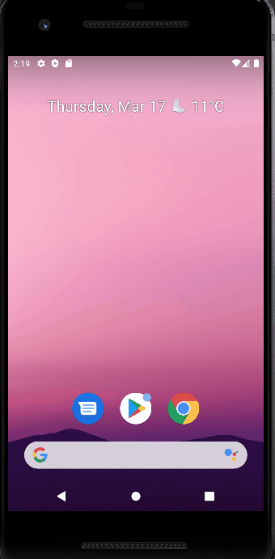
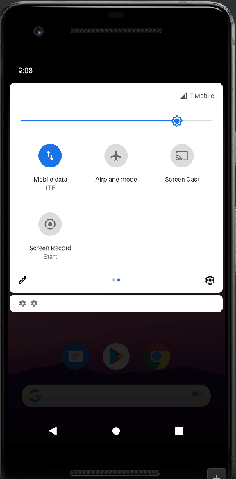

# Ravn-Challenge-V3-FabrizioFloresPari

## Setup/Running instructions
Recommended to use Android Studio with Kotlin version 1.5.30 at least, on a device with SDK 21: Android 5.0 (Lollipop) at least. Clone the repository and then build it with Android Studio.

## Project description
An Android mobile app that allows you to browse the Star Wars GraphQL API.

## App demo

## Technologies used
- Apollo Client
- SWAPI Graphql API
- Android Data Binding 
- Kotlin Coroutines

